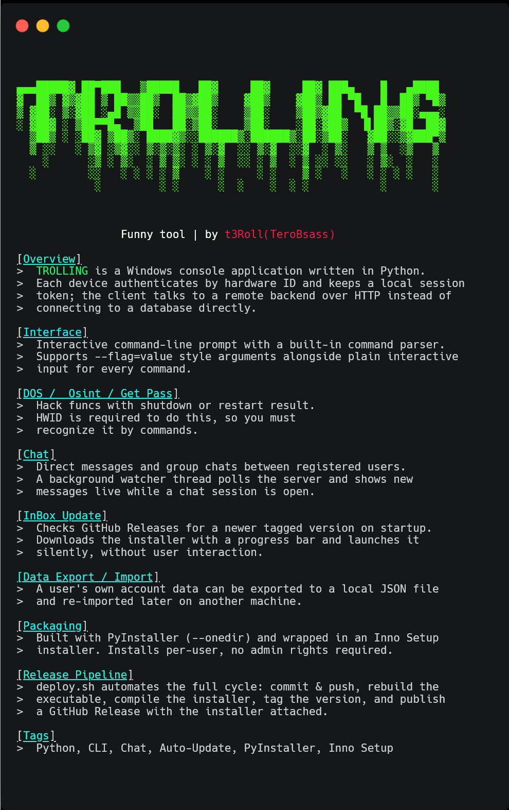
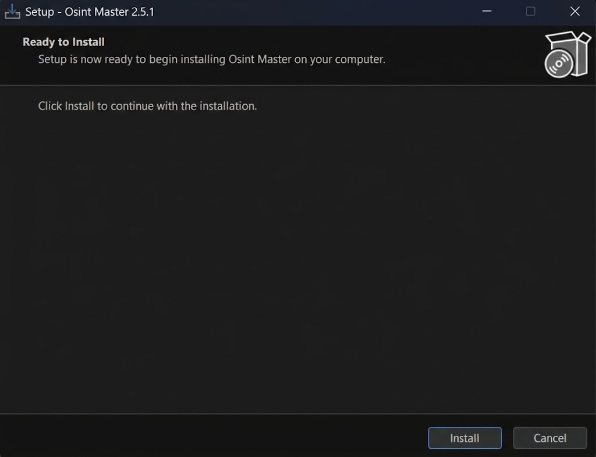

# TROLLING
<figure><figcaption></figcaption></figure>

---

### Setup

**Installing .iso file from realeses**

```bash
https://github.com/TeroBsass/osint_master/releases
```

**Do .iso intractions and install tool**

> In opened window click to Install 
<br>

<figure><figcaption></figcaption></figure>

> and then to Finish
<br>

<figure><figcaption></figcaption></figure>

---

### Usage

**Reg**
> Register your acc

<figure><figcaption></figcaption></figure>


**Commands**

<figure><figcaption></figcaption></figure>

## Need
What you need:
 - VPN(for Russia and another countries like that)
 - Windows OS(For windows only now, sorry)
 - Internet connection for sure


<p align="center">Great usage and having fun</p>
