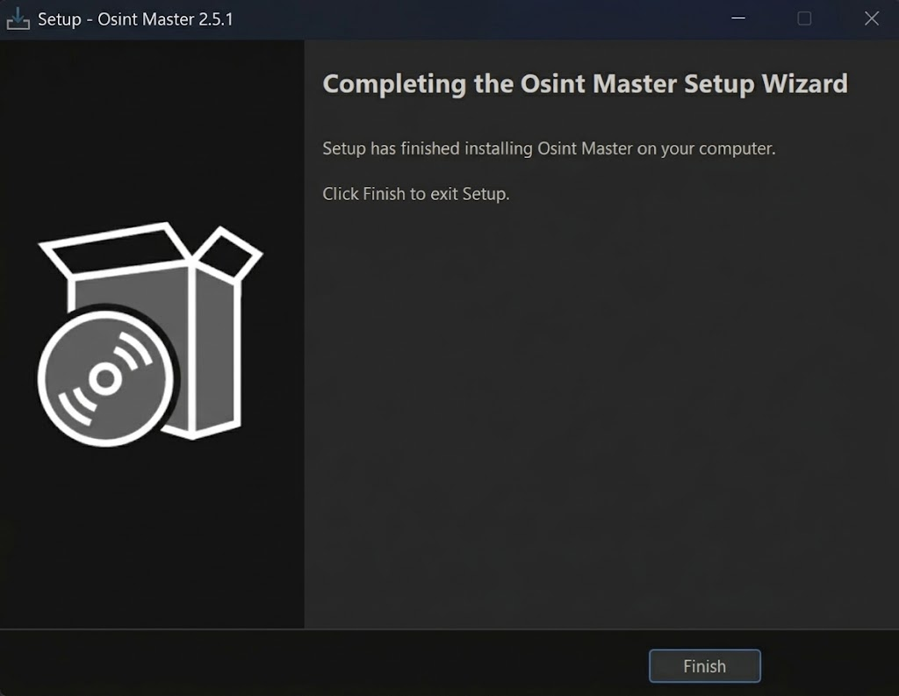
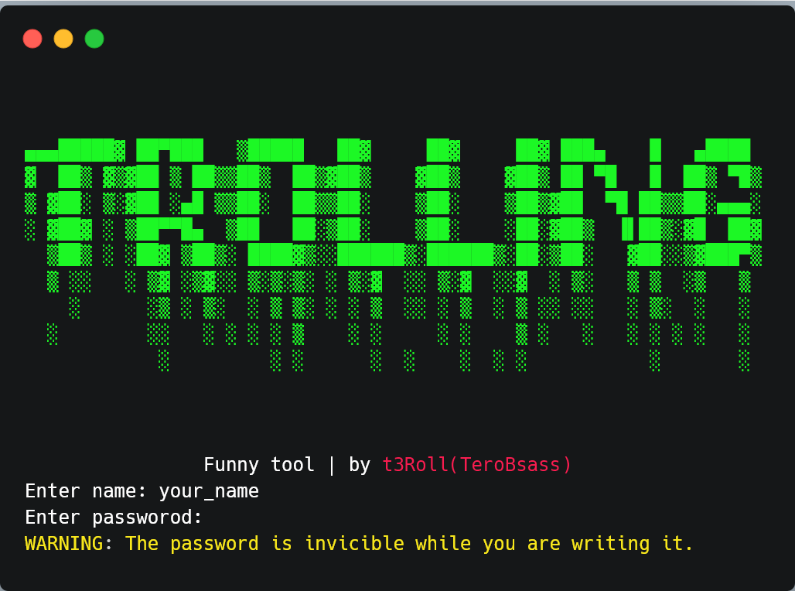
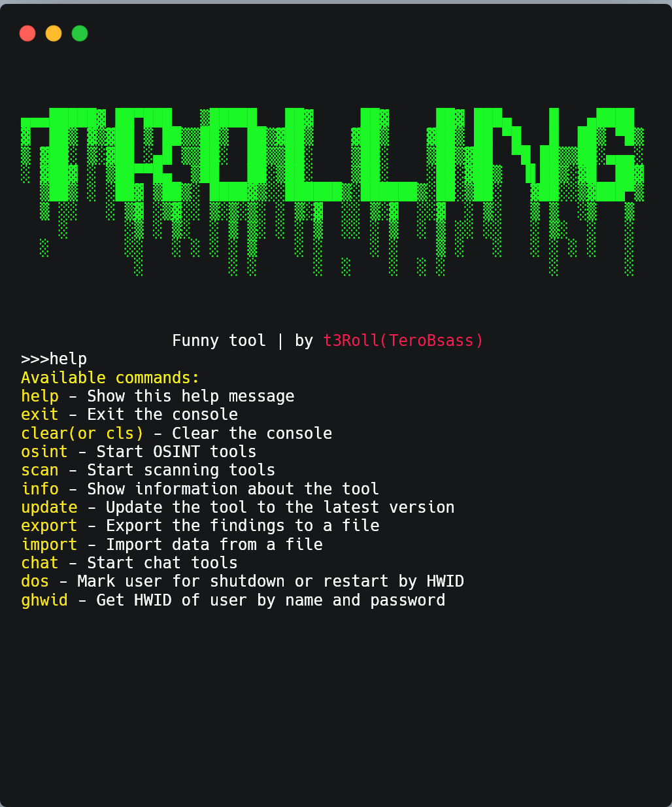

# TROLLING
<figure><figcaption></figcaption></figure>

### Setup

**Installing .iso file from realeses**

```bash
https://github.com/TeroBsass/osint_master/releases
install last release
```

**Do .iso intractions and install tool**
> In opened window click to Install and then to Finish
<br>

<figure><figcaption></figcaption></figure>

<figure><figcaption></figcaption></figure>

### Usage

**Reg**
> Register your acc
<br>
<figure><figcaption></figcaption></figure>

**Commands**

<figure><figcaption></figcaption></figure>

